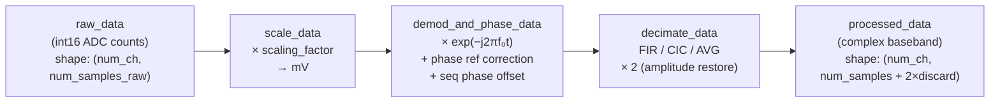

# RxData

`RxData` is the central data container for a single ADC gate event. It is created by the [Sequence Provider](../pulseq_interpreter/sequence_provider.md) during sequence unrolling and populated with raw sample data by the [RX card](../spcm_control/rx_device.md) during acquisition. After the acquisition loop, `process_data` executes the complete post-processing pipeline in place.

## Post-processing pipeline

### 1. Scaling (`scale_data`)

Raw `int16` ADC values are multiplied by the per-channel `scaling_factor` to convert to millivolts:

$$
d_\text{mV}[c, n] = d_\text{ADC}[c, n] \cdot \frac{V_\text{max,c}}{2^{15}}
$$

where $V_\text{max,c}$ is the configured input amplitude limit for channel $c$ in mV.

### 2. Demodulation and phase correction (`demod_and_phase_data`)

The scaled signal is demodulated to baseband by mixing with a complex exponential at the demodulation frequency $f_\text{demod} = f_0 + \Delta f$:

$$
d_\text{bb}[c, n] = d_\text{mV}[c, n] \cdot e^{-j 2\pi f_\text{demod} \cdot n \Delta t}
$$

where $\Delta t$ is the raw dwell time (`dwell_time_raw`).

If a phase reference is available, it is demodulated at the reference frequency $f_\text{ref}$ (1.095 MHz) and the phase correction angle $\phi_\text{corr}$ is computed from the integrated demodulated reference:

$$
\phi_\text{corr} = \arg\!\left(\sum_n r[n] \cdot e^{-j 2\pi f_\text{ref} n \Delta t}\right) \cdot \frac{f_\text{demod}}{f_\text{ref}}
$$

The correction is applied as $d_\text{bb} \leftarrow d_\text{bb} \cdot e^{-j \phi_\text{corr}}$. Finally, the sequence-defined phase offset $\Delta\varphi$ (`phase_offset`) is applied: $d_\text{bb} \leftarrow d_\text{bb} \cdot e^{j \Delta\varphi}$.

### 3. Decimation (`decimate_data`)

The complex baseband signal is decimated by `decimation_factor = round(dwell_time / dwell_time_raw)` along the readout dimension. Three methods are available, selected by `ddc_method`:

| Method | Description |
|---|---|
| `DDCMethod.FIR` | `scipy.signal.decimate` with FIR anti-aliasing filter (default, lowest spectral leakage) |
| `DDCMethod.CIC` | Two-stage CIC + FIR compensation (fastest for high decimation factors) |
| `DDCMethod.AVG` | Strided convolution with a Hann-like kernel (useful when linear phase is critical) |

After decimation, the signal amplitude is multiplied by 2 to recover the 50% amplitude loss introduced by the mixing step (only when $f_0 > 0$, i.e. the demodulation was not at DC).

The final `processed_data` array has shape `(num_channels, num_samples + 2 × num_samples_discard)`. Dead-time samples at both ends of the gate are retained in the array but should be discarded by the user when computing spectra or k-space.

## ADC gate metadata

Each `RxData` instance also stores timing and labelling metadata:

- `index` — sequential index of the ADC event within the sequence.
- `num_samples` — expected number of useful samples after decimation.
- `num_samples_discard` — samples to discard at each edge (from ADC dead time).
- `dwell_time` — target dwell time after decimation (s).
- `dwell_time_raw` — TX/RX card sample period (s).
- `phase_offset` / `freq_offset` — per-event offsets from the PyPulseq ADC definition.
- `labels` — PyPulseq block labels (e.g. `lin`, `sli`, `seg`) for k-space sorting.
- `time_stamp` — time of gate start relative to sequence start (s), read from the card timestamp buffer.
- `average_index` — which acquisition average this gate belongs to.

---

::: console.interfaces.rx_data
