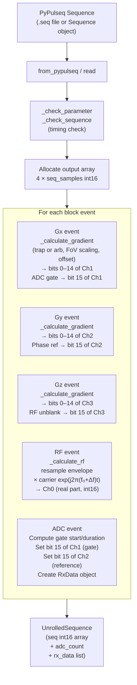

# Sequence Provider

`SequenceProvider` translates a PyPulseq pulse sequence description into the low-level `int16` waveform arrays consumed by the Spectrum Instrumentation AWG card. It inherits from the PyPulseq `Sequence` class, giving direct access to all PyPulseq sequence construction and validation methods while adding the hardware-specific unrolling logic.

## Unrolling pipeline



## Output array layout

The output is a single flat `int16` array of length `4 × seq_samples`, representing four interleaved channels in Fortran order:

```
[ch0₀, ch1₀, ch2₀, ch3₀, ch0₁, ch1₁, ch2₁, ch3₁, …, ch3_N]
```

Individual channels are extracted with stride-4 slicing:

```python
rf   = seq[0::4]                            # RF waveform (full int16 resolution)
gx   = (seq[1::4] << 1).astype(np.int16)   # Gx (bit 14 → sign, bit 15 discarded)
gy   = (seq[2::4] << 1).astype(np.int16)   # Gy
gz   = (seq[3::4] << 1).astype(np.int16)   # Gz

adc_gate    = seq[1::4].view(np.uint16) >> 15   # 0 or 1
phase_ref   = seq[2::4].view(np.uint16) >> 15   # 0 or 1
unblank     = seq[3::4].view(np.uint16) >> 15   # 0 or 1
```

## RF waveform calculation

`_calculate_rf` computes the modulated RF waveform for a single block event. The calculation proceeds as follows:

1. **Sample counts** — the delay, dead-time, and pulse shape duration are each converted to sample counts on the TX card time raster ($f_\text{spcm}$).
2. **Unblanking signal** — the RF unblanking window begins at `delay − dead_time` samples and ends at `delay + shape_samples` samples. The unblanking is stored as a `uint16` array with bit 15 set during the active window.
3. **Amplitude scaling** — the complex PyPulseq envelope `block.signal` (in Hz) is scaled to the `int16` range:

$$
A_\text{scaled} = A_\text{env} \cdot \alpha_{B_1} \cdot \kappa_\text{rf} \cdot \frac{\text{INT16\_MAX}}{V_\text{RF,limit}}
$$

   where $\alpha_{B_1}$ is `b1_scaling`, $\kappa_\text{rf}$ is `rf_to_mvolt`, and $V_\text{RF,limit}$ is the RF channel output limit in mV. A `ValueError` is raised if the peak amplitude exceeds 1.0 (i.e., the output limit).
4. **Resampling** — the scaled envelope is resampled from the PyPulseq RF raster to the TX card sample raster using `scipy.signal.resample`.
5. **Carrier modulation** — the modulated waveform is:

$$
s(t) = A(t) \cdot e^{j 2\pi (f_0 + \Delta f)\, t + j \Delta\varphi}
$$

   where $f_0$ is `larmor_frequency`, $\Delta f$ is `block.freq_offset`, and $\Delta\varphi$ is `block.phase_offset`.
6. **Insertion** — the real part of the modulated waveform is cast to `int16` and placed in the output array at position `[delay_samples::4]` (Ch0 stride).

## Gradient waveform calculation

`_calculate_gradient` handles both trapezoidal (`trap`) and arbitrary (`grad`) gradient types.

**Scaling** — the PyPulseq gradient amplitude (in Hz/m) is converted to millivolts, then normalised to the `int16` range:

$$
s_\text{mV}(t) = \frac{s_\text{Hz/m}(t) \cdot s_\text{FoV}}{2\pi \cdot \gamma \cdot G_\text{gain} \cdot \eta_G \cdot 10^3}
$$

$$
s_\text{i16}(t) = s_\text{mV}(t) \cdot \frac{\text{INT16\_MAX}}{V_\text{out,limit}}
$$

where $\gamma = 42.577\,\text{MHz/T}$, $G_\text{gain}$ is GPA gain (V/A), $\eta_G$ is gradient coil efficiency (mT/m/A), and $V_\text{out,limit}$ is the channel output limit in mV. The field-of-view scaling factor `fov_scaling` and the DC offset (gradient shim) are validated against the output limit before writing to the array.

**Trapezoidal gradients** — rise, flat, and fall sections are constructed as linearly interpolated arrays on the TX card raster and concatenated.

**Arbitrary gradients** — the waveform is linearly interpolated from the PyPulseq time grid onto the TX card raster using `np.interp`.

**Digital embedding** — after scaling, the gradient `int16` array is right-shifted by one bit (as `uint16`) to vacate bit 15 for the digital control signal. The digital signal (ADC gate, phase reference, or unblanking) is OR'd into bit 15 in the main `unroll_sequence` loop.

## ADC event and RxData construction

For each ADC block event, `unroll_sequence`:

1. Computes the number of samples to discard at each side of the gate (`num_samples_discard = dead_time // dwell_time`).
2. Computes the total raw gate duration: `(num_samples + 2 × num_samples_discard) × dwell_time`.
3. Sets the ADC gate signal (bit 15 of Ch1) and the phase reference signal (bit 15 of Ch2) in the output array for the gate duration.
4. Creates an `RxData` object encoding all gate metadata (sample counts, dwell times, frequency/phase offsets, DDC method, labels).

## Sequence validation

Before unrolling, two validation checks are performed:

- `_check_parameter` — verifies that the Larmor frequency is below the Nyquist limit ($f_0 < f_\text{spcm}/2$), is positive, and that `channel_assignment` is a valid permutation of {1, 2, 3}.
- `_check_sequence` — verifies that at least one block event is present and that PyPulseq's `check_timing()` passes.

## PyPulseq interoperability

`SequenceProvider.from_pypulseq(seq)` copies all block events and definitions from an external `Sequence` object into the provider, re-initialising the parent `Sequence` from scratch to avoid state contamination. `to_pypulseq()` performs the inverse: it creates a new `Sequence` from the provider's internal state, which is used to populate `AcquisitionData.sequence`.

---

::: console.pulseq_interpreter.sequence_provider
