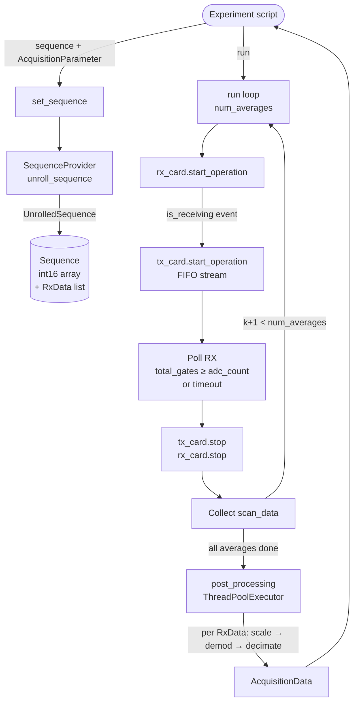

# Acquisition Control

The `AcquisitionControl` class is the central orchestrator of the Nexus Console. It owns instances of the [Sequence Provider](../pulseq_interpreter/sequence_provider.md), the [TX card](tx_device.md), and the [RX card](rx_device.md), and exposes a simple three-step interface for running experiments: `set_sequence` → `run` → `AcquisitionData`.

## Architecture



## Initialisation

`AcquisitionControl.__init__` performs four actions:

1. Reads and validates the YAML device configuration file into a `NexusConfiguration` Pydantic model.
2. Instantiates a `SequenceProvider` with hardware parameters (gradient efficiency, GPA gain, output limits, sampling rate).
3. Instantiates `TxCard` and `RxCard` objects and calls `connect()` on each, which resets the card and runs `setup_card()`.
4. Creates a dated session directory at `~/nexus-console/<date>-session/` for log files and data.

Card connection failures are caught and both cards are disconnected safely before re-raising.

## Sequence loading and unrolling

```python
acq.set_sequence(sequence=seq, parameter=params)
```

`set_sequence` accepts either a PyPulseq `Sequence` object or a path to a `.seq` file. Internally it calls `SequenceProvider.unroll_sequence(parameter)`, which translates every block event into `int16` sample arrays and records the metadata of every ADC event as a list of `RxData` objects. The result is stored as an `UnrolledSequence` on the instance.

The unrolling step is computationally intensive for long sequences (e.g., a full 3D TSE volume). It is separated from the acquisition loop so that waveforms can be validated and inspected before hardware access begins.

## Acquisition loop

```python
acq_data = acq.run(store_unprocessed=False)
```

The acquisition loop iterates over `parameter.num_averages`. For each average:

1. A deep copy of the `UnrolledSequence.rx_data` list is assigned to the RX card (each RxData object will be filled in by the card thread).
2. The RX card thread is started first. The main thread blocks until the `is_receiving` threading event is set, confirming the card is armed and awaiting a trigger.
3. The TX card thread is started, initiating FIFO streaming. This generates the ADC gate signal that triggers the RX card.
4. The main thread polls `rx_card.total_gates` every 10 ms until all expected gates have been received or the sequence timeout is exceeded.
5. The TX and RX card threads are stopped; the collected `RxData` objects for the current average are appended to `receive_data`.
6. If `parameter.averaging_delay > 0`, a configurable inter-average delay is applied.

A timeout of `5 + sequence.duration` seconds is enforced per average to guard against hardware lock-up.

## Post-processing

After all averages have been collected, `post_processing` is called once, dispatching each `RxData` object to its `process_data` method via a `ThreadPoolExecutor`. The per-object processing pipeline is:

```
scale_data    →    demod_and_phase_data    →    decimate_data
   (ADC → mV)     (× exp(−j2πf₀t), phase    (FIR / CIC / AVG)
                   ref correction, seq phase)
```

See [`RxData`](../interfaces/rx_data.md) for a detailed description of each step.

## Gradient DC offsets

Before each acquisition loop, `TxCard.set_gradient_offsets` writes DC offset values (from `AcquisitionParameter.gradient_offset`) to the card hardware registers. These offsets shift the operating point of the gradient amplifier and can be used to compensate for static field gradients (e.g., for shimming). Offsets are reset to zero after the loop completes.

## Waveform inspection

```python
fig, axes = acq.plot_waveforms(time_range=(0.0, 5e-3))
```

`plot_waveforms` delegates to `plot_unrolled_sequence` and renders the RF, gradient, ADC gate, and unblanking waveforms for a selected time window. This is useful for verifying that the unrolled sequence matches expectations before committing to a hardware acquisition.

## Cleanup

The `AcquisitionControl` destructor (`__del__`) calls `disconnect()` on both cards, which stops card operation, resets the card, and closes the device handle. Experiments should call `del acq` explicitly at the end of a script to ensure timely resource release.

---

::: console.spcm_control.acquisition_control
