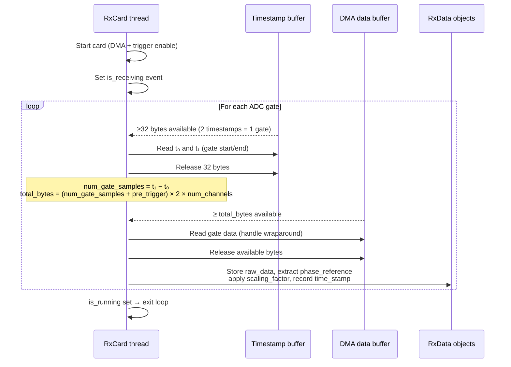

# RX Card (RxCard)

`RxCard` implements the receive path of the Nexus Console. It drives the Spectrum Instrumentation M2p.5933-x4 digitizer card in gated FIFO mode, continuously sampling up to eight analogue channels and extracting gate segments triggered by the ADC gate signal from the TX card.

## Gated FIFO acquisition

In gated FIFO mode (`SPC_REC_FIFO_GATE`), the card samples all enabled channels into a circular 1 GB DMA buffer and uses a hardware timestamp engine to record the precise start and end of each active gate. This mode avoids the need to pre-calculate gate positions: the card simply runs continuously and is told, after each gate, how much data to retain.

## Gate detection and timestamp logic

The card's timestamp engine runs in `SPC_TSMODE_STARTRESET` mode with internal counter, triggered on the positive edge of the X1 auxiliary input (the ADC gate signal from TX X1). Each gate produces exactly two 32-bit timestamps:

- **t₀** — sample index at gate start (rising edge of X1).
- **t₁** — sample index at gate end (falling edge of X1).

The gate duration in samples is `num_gate_samples = t₁ − t₀`. The gate duration in time is `gate_duration = num_gate_samples / (sample_rate × 10⁶)`.

The actual data read from the DMA buffer includes a pre-trigger window (8 samples, fixed) before the gate start. Pre-trigger samples are discarded before storing the data in the `RxData` object.

## Phase reference extraction

The digital phase reference signal received at X2 is sampled synchronously with analogue channel 0. The card is configured via `SPC_DIGMODE0` to encode the X2 state in bit 15 of each channel-0 sample. During gate readout, the RX card:

1. Extracts bit 15 of the raw channel-0 data → `gate.phase_reference` (up to 1000 samples).
2. Left-shifts all channel-0 samples by one bit (as `uint16`) to discard bit 15 and restore 15-bit analogue resolution → `gate.raw_data[0]`.

## Buffer wraparound

The 1 GB ring buffer wraps around during long acquisitions. The `_gated_timestamps_stream` method handles wraparound by splitting the gate read into two contiguous numpy slices (one from the current buffer position to the end, one from the start to the remaining length) and concatenating them.

## Memory overflow detection

If the accumulated data volume from remaining bytes and newly available bytes exceeds the 1 GB ring buffer, a `MemoryError` is raised. This guards against the scenario where the gate data arrives faster than it can be processed.

## Card setup details

`setup_card()` configures:

- **Clock**: internal PLL (`SPC_CM_INTPLL`) with clock output enabled (`SPC_CLOCKOUT = 1`), providing the master clock to the TX card.
- **Trigger**: external trigger on X1 (`SPC_TRIG_EXT1_MODE = SPC_TM_POS`), positive edge.
- **Channels**: enabled and configured per `channel_enable`, `max_amplitude`, and `impedance_50_ohms` from `RxConfiguration`.
- **Digital filter**: disabled (`SPC_DIGITALBWFILTER = 0`).
- **Digital input**: X2 in digital input mode (`SPCM_XMODE_DIGIN`), sampled synchronously with Ch0.
- **Post-trigger**: `4096 // num_active_channels` samples (minimum one notify-size chunk per active channel).
- **Timeout**: 10 ms DMA wait timeout.
- **Card mode**: gated FIFO (`SPC_REC_FIFO_GATE`).

---

::: console.spcm_control.rx_device
