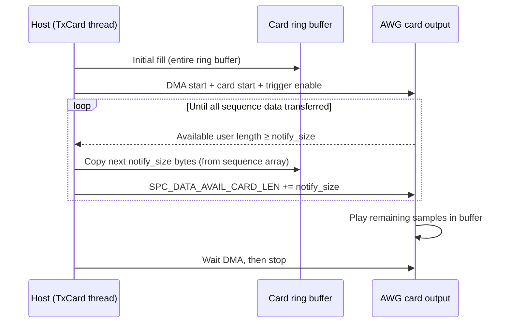

# TX Card (TxCard)

`TxCard` implements the transmit path of the Nexus Console. It drives the Spectrum Instrumentation M2p.6546-x4 AWG card in FIFO single mode, streaming RF and gradient waveforms from host memory to the card's analogue outputs in real time.

## FIFO streaming architecture

The M2p.6546-x4 has 1 GB of on-board memory (512 MSamples × 2 bytes). For sequences that exceed this memory, the card's **FIFO single mode** (`SPC_REP_FIFO_SINGLE`) streams data from the host PC in segments, re-filling the card's ring buffer as it is consumed.



### Ring buffer and notify size

The ring buffer is sized to fit the entire sequence data or 1 GB (whichever is smaller), rounded up to a multiple of the notify size. The notify size is set to 1/16 of the ring buffer size, with a minimum of 4096 bytes. This ensures that the host transfer loop runs infrequently while keeping latency low.

### Data format

The sequence data array is a flat `int16` numpy array in interleaved Fortran (column-major) order:

```
[ch0₀, ch1₀, ch2₀, ch3₀, ch0₁, ch1₁, ch2₁, ch3₁, ..., ch3_N]
```

Each sample is 2 bytes (int16). The four channels map to RF (Ch0), Gx (Ch1), Gy (Ch2), and Gz (Ch3). Channels 1–3 have bit 15 reserved for the synchronous digital outputs (ADC gate, phase reference, RF unblanking respectively).

## Card setup

`setup_card()` configures the card as follows:

- **Clock**: external clock mode (`SPC_CM_EXTERNAL`), 50 Ω termination, 1.5 V threshold. The clock source is the RX card's internal PLL output.
- **Trigger**: software trigger (`SPC_TMASK_SOFTWARE`) — the sequence starts immediately when the card is started via command.
- **Channels 0–3**: all enabled, amplitudes and output filters set per configuration.
- **Digital outputs**: X1 = bit 15 of Ch1 (ADC gate), X2 = bit 15 of Ch2 (phase reference), X3 = bit 15 of Ch3 (RF unblanking).
- **Card mode**: FIFO single (`SPC_REP_FIFO_SINGLE`).

### IO expansion card

If the card features an FX2 or SMB IO expansion module (`SPCM_FEAT_DIG16_FX2` or `SPCM_FEAT_DIG16_SMB`), `setup_card` additionally routes the ADC gate to X12 and the RF unblanking signal to X13. These replicated outputs can be used to drive additional external components such as TR switches or external triggers.

## Gradient DC offsets

`set_gradient_offsets(offsets, is_50ohms)` writes DC offset values (in mV) to the card hardware registers for channels 1–3 (Gx, Gy, Gz). This is used to apply static field gradient corrections (shimming). If the gradient outputs are terminated into high impedance (`is_50ohms = False`), the requested offset values are halved before being written, as the card output will double at the high-impedance load.

---

::: console.spcm_control.tx_device
