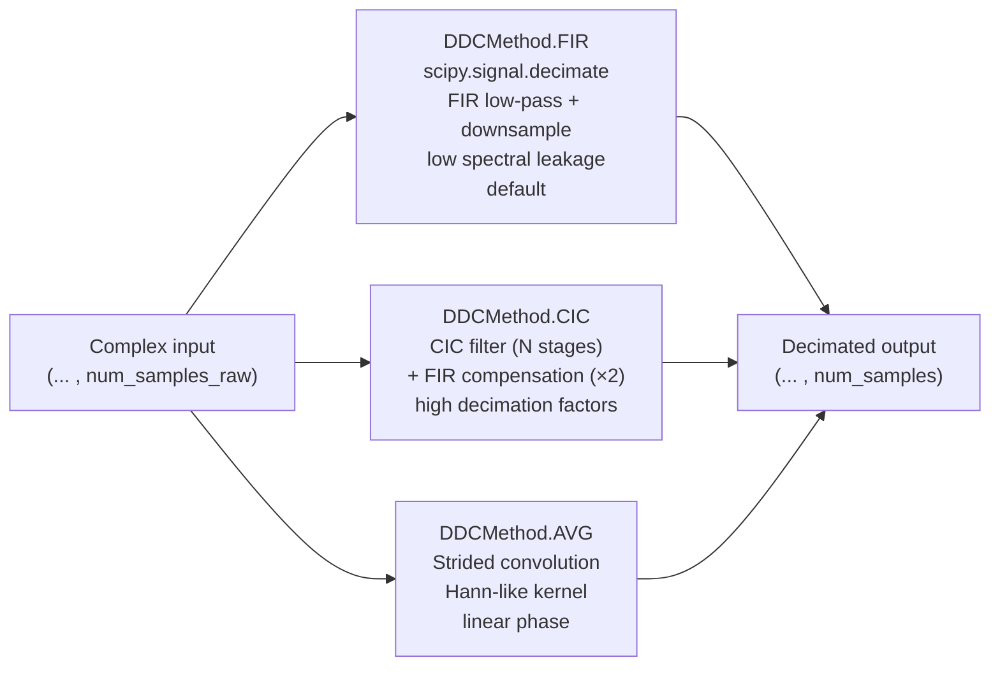

# Digital Down Converter (DDC)

The `ddc` module provides the digital signal processing functions used during post-processing to decimate the complex baseband signal from the RX card sampling rate to the target readout bandwidth. All three functions operate on the last axis (readout dimension) of an arbitrary-shape complex input array, making them compatible with multi-coil, multi-average, and multi-phase-encoding data without reshaping.

## Why decimation is necessary

The RX card samples at a fixed hardware rate (typically 20 MHz). The desired spectral bandwidth for most MRI experiments is far narrower (e.g. a 10 kHz readout bandwidth at a decimation factor of 2000). Directly using the raw data would require storing and processing orders of magnitude more samples than necessary. Decimation low-pass-filters and downsamples the data, delivering the target number of readout samples per gate.

## Post-demodulation amplitude correction

All three functions multiply the output by a factor of 2 to compensate for the 50% amplitude loss introduced by the complex demodulation step (where the negative-frequency component of the real input signal is discarded). This correction is applied in `RxData.decimate_data` only when `larmor_frequency > 0`.

## Available methods

### FIR decimation (`DDCMethod.FIR`)

Delegates to `scipy.signal.decimate(data, q=decimation_factor, ftype="fir", axis=-1)`. This applies a Kaiser-windowed FIR low-pass filter prior to downsampling, providing excellent stopband attenuation and linear phase. It is the recommended method for most experiments.

### CIC + FIR compensation (`DDCMethod.CIC`)

Implements a cascaded integrator–comb (CIC) filter followed by an FIR compensation stage:

1. **CIC integration** — `N = 5` integrator stages (`np.cumsum` along readout axis), each integrating the previous output.
2. **Decimation** — downsampling by `cic_decimation = num_samples_raw // (2 × num_samples_target)` (approximate half-rate).
3. **CIC comb** — `N = 5` differentiator stages.
4. **Normalisation** — output divided by `cic_decimation^N` to restore amplitude.
5. **FIR compensation** — `scipy.signal.decimate` with factor 2 and FIR filter to suppress the CIC passband droop and halve the sample count to the target.

This method is most efficient for very high decimation factors (> 200), where the multi-stage cascade reduces computational cost compared to a single long FIR filter.

### Moving-average decimation (`DDCMethod.AVG`)

Implements a strided convolution with a smooth, window-like kernel:

$$
k(x) = e^{-1/(1-x^2)} \cdot \frac{\sin(2.073\pi x)}{x}, \quad x \in (-1, 1)
$$

The kernel is computed on `overlap × decimation_factor` points, and the convolution is applied at a stride of `decimation_factor`. Zero-padding with `overlap/2 × decimation_factor` samples on each side centres the decimated output relative to the input. This method is useful when linear phase response and low group delay variation are more important than computational efficiency.

---

::: console.utilities.ddc
