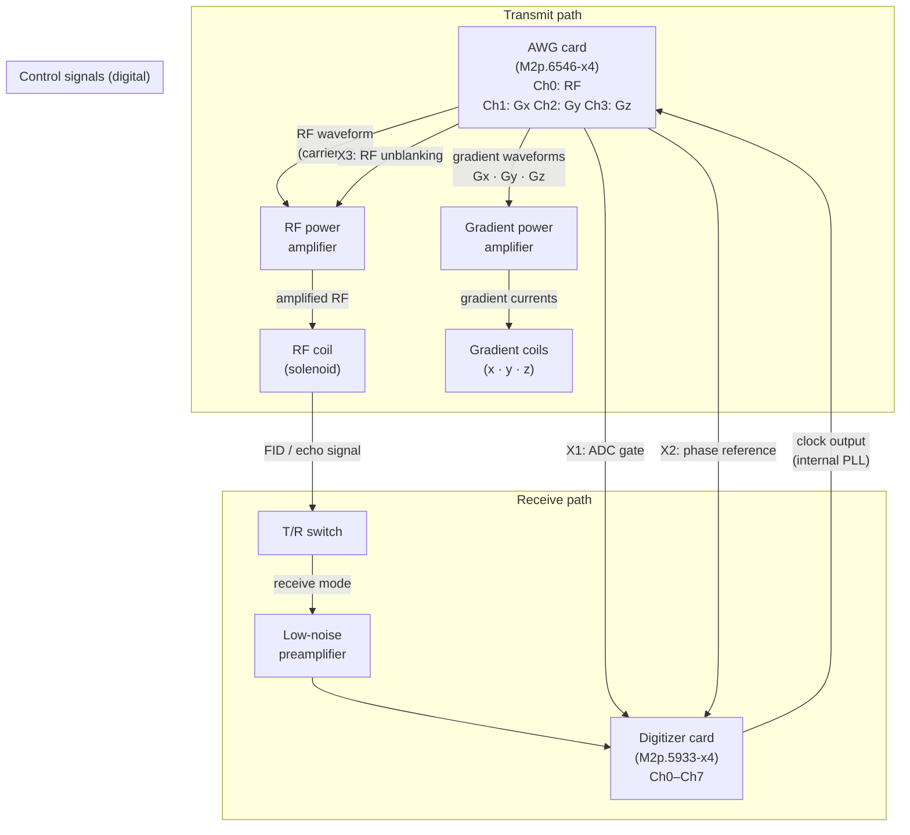

# System Setup

## MRI System Overview

The target system is a low-field, permanent-magnet MRI scanner operating at approximately 50 mT, generated by a Halbach-configured permanent magnet array. Spatial encoding is achieved via three orthogonal gradient coils (x, y, z) driven by a gradient power amplifier (GPA). A solenoid volume RF coil is operated in transmit–receive mode: a passive transmit–receive (T/R) switch alternates the coil connection between the RF power amplifier (RFPA) during excitation and a low-noise preamplifier during signal reception.

The complete hardware signal chain is illustrated in the following diagram:



The two Spectrum Instrumentation PCIe cards assume complementary roles:

| Card | Model | Role |
|---|---|---|
| Transmit (TX) | M2p.6546-x4 | Arbitrary waveform generator; replays RF and gradient waveforms |
| Receive (RX) | M2p.5933-x4 | Digitizer; samples the NMR signal in gated FIFO mode |

## Clock and Synchronisation Architecture

The receive card operates with its internal PLL as the master clock source and exports this clock signal (`SPC_CLOCKOUT = 1`). The transmit card is configured in external clock mode (`SPC_CM_EXTERNAL`) and receives the clock from the RX card output. This arrangement ensures that both cards operate phase-coherently from a common timebase.

!!! note "Why RX is the clock master"
    Placing the clock master on the RX card guarantees that the ADC sampling grid is locked to the card's own internal reference, avoiding jitter introduced by routing the clock from TX to RX. The TX card, which generates waveforms at a known sample rate, can tolerate sourcing its clock from the RX output.

Hardware synchronisation between the two cards is achieved entirely through digital signals transmitted via coaxial cables between the cards' auxiliary connectors:

| TX output | RX input | Signal | Purpose |
|---|---|---|---|
| X1 | Trigger (EXT1) | ADC gate (active high) | Triggers gated acquisition on RX |
| X2 | X2 (digital input) | Phase reference | Corrects inter-card phase drift |
| X3 | — | RF unblanking | Enables RFPA during transmit |

## Waveform Encoding in the Transmit Card

The M2p.6546-x4 AWG operates with four analogue output channels. RF and gradient waveforms are all replayed from a single interleaved `int16` array in Fortran (column-major) order: `[ch0₀, ch1₀, ch2₀, ch3₀, ch0₁, ch1₁, …]`. This format allows the spectrum card to pipeline all channels from a single DMA buffer.

Each gradient channel encodes a synchronous digital control signal in the most significant bit (bit 15) of its 16-bit output word:

| TX channel | Analogue function | Digital function (bit 15) | TX digital output |
|---|---|---|---|
| Ch 0 | RF waveform (I+Q modulated at f₀) | — (full 16-bit resolution) | — |
| Ch 1 | Gradient Gx | ADC gate | X1 |
| Ch 2 | Gradient Gy | Phase reference signal | X2 |
| Ch 3 | Gradient Gz | RF unblanking / RFPA enable | X3 |

To embed the digital signal without losing analogue resolution, gradient waveforms are right-shifted by one bit before the digital bit is OR'd into position 15:

```
output_uint16 = (gradient_int16.view(uint16) >> 1) | (digital << 15)
```

The TX card's auxiliary outputs are configured to mirror bit 15 of the respective analogue channel, making the digital signals available at the SMA connectors as 3.3 V logic levels.

## Phase Reference Signal

A phase reference signal is generated by the sequence provider and transmitted from TX X2 to RX X2. On the receive side, the digital input at X2 is sampled synchronously with analogue channel 0 and encoded in bit 15 of that channel's data stream (`SPC_DIGMODE0`). The receive card reads up to 1000 samples of this reference at each ADC gate.

During post-processing, the reference signal is demodulated at the reference frequency (1.095 MHz) and the resulting phase angle is used to correct the MR data, compensating for any inter-card phase drift that accumulates between acquisitions.

## Data and Configuration Files

Acquired data and session logs are written to `~/nexus-console/<date>-session/` by default. The data directory is created automatically if it does not exist.

The hardware is described by a YAML configuration file (`device_config.yaml`). See [Measurement cards](cards.md) for a full description of all configuration fields and their physical meaning.
