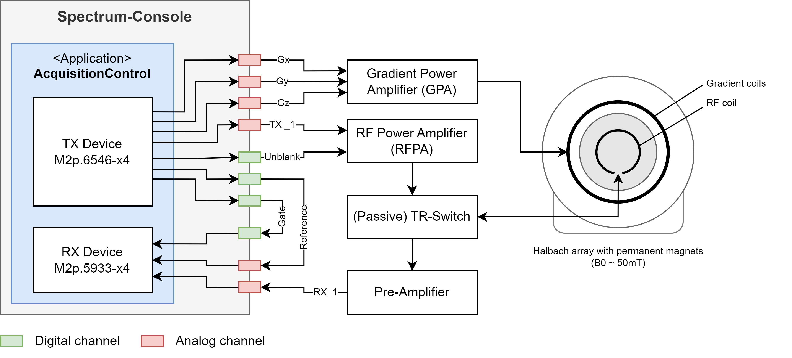

System Overview
===============

This console application was developed within the scope of a low-field MRI system.
The core component of the console are two measurement cards from Spectrum-Instrumentation which are installed via two PCI express slots of the console computer.
They provide analog transmit (TX) and receive (RX) channels, as well as digital GPIO ports to drive the MRI scanner.
The console application is intended to provide a simple interface to these measurement cards to enable all common MRI procedures.
Also, the integration of additional sensor technology is facilitated on both, the hardware and the software sides.
The installation of GPU's within the console computer then allows the application of advanced machine-learning-based techniques, directly on the recorded raw data.

The setup the application was developed with is described in the following high-level diagram.
The magnet is build of permanent magnets in Halbach configuration providing a static magnetic field of about 50 mT.
It is equipped with three gradient coils for spatial encoding and a solenoid volume coil.
The TX card is used to generate the analog gradient waveforms, which are amplified by a 
gradient power amplifier (GPA) to drive the three gradient coils of the MRI system.
To switch between transmit and receive mode, a passive TR switch is used.
The transmit RF pulse is generated digitally and replayed by the TX card. 
The replayed analog signal is amplified by an RF power amplifier (RFPA) and send to the coil.
In receive mode, the MR signal is pre-amplified and digitized by the RX card.

A digital ADC gate signal controls the sampling of the MR signal in receive mode. 
To only amplify the transmit line in case of an RX pulse event, a digital un-blanking signal is used to open the RFPA.
To prevent phase incoherences caused by clock drifts or gitter effects, a digital reference signal is transfered between the measurement cards 
in order to correct the phase information of the sampled MR signal.

Figure 1: Low-field MRI system overview

Hardware Components
-------------------

- Spectrum Instrumentation Arbitrary Waveform Generator (AWG) card M2p.6546-x4
- Spectrum Instrumentation Digitizer card M2p.5933-x4