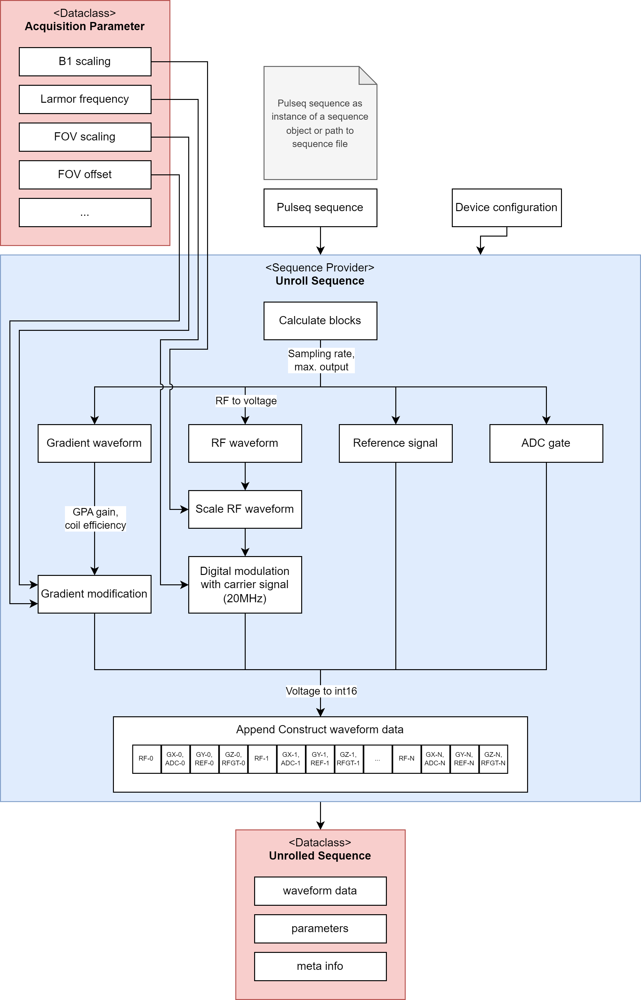
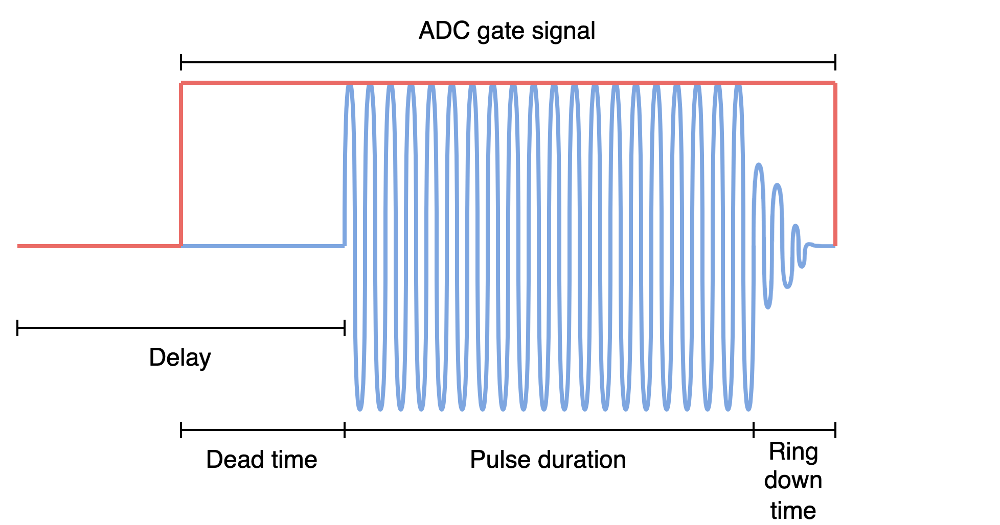
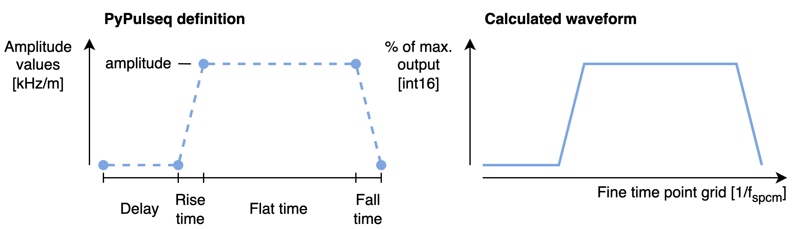
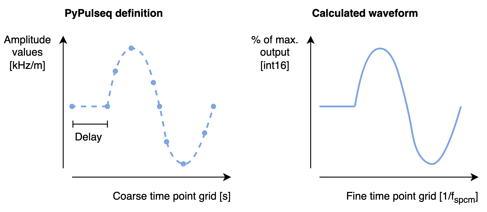

.. _seq-provider:

Sequence Provider
=================

For sequence description, the open-source standard pulseq, i.e. the python implementation `PyPulseq <https://github.com/imr-framework/pypulseq>`_ is used.
The sequence provider is build on top of the ``Sequence`` class from the pypulseq package and adds functionalities to compute the waveforms described by pulseq.

.. seealso:: 
   For detailed documentation of the PyPulseq package, see `PyPulseq documentation <https://pypulseq.readthedocs.io/en/dev/>`_.

Overview
--------

Once the sequence provider has been created, a new pulseq sequence can be loaded by using the build in routine which reads a sequence from *.seq* file.
Alternatively, a sequence can be set from an existing ``Sequence`` object.
During the sequence calculation or unrolling process, each block is successively calculated depending on the event types it contains.
The calculated waveforms are stored in a list, where each entry is a *numpy* array which contains all the waveform definitons of a block.
The waveforms within each array are in column-major (Fortran-style) order.
Within the unrolling process, which is shown in :numref:`seq-provider-flow`, all the physical values are translated to ``int16`` values, as explained below.

   Overview flow chart of the sequence unrolling in the sequence provider class.

Interfaces
----------

To correctly calculate the RF and gradient waveforms, as well as the digital control signals, some additional information are required by the sequence provider.
Some of the required parameters are defined in the device configuration.
Others depend on the experiment and are provided by the user, they are defined in :ref:`acquisition parameter <acquisition-parameter>`.
A summary of all the required parameters is given below:

.. csv-table:: Overview of sequence provider parameters
   :file: ../_tables/seq_provider_parameters.csv
   :widths: 10, 15, 30, 40
   :header-rows: 1

The result is an :ref:`unrolled sequence <unrolled-sequence>` which contains all the waveforms and some meta data of the calculated sequence.

Unrolling
---------

To unroll a sequence a new zero-filled array is created per block depending on the block duration.
It holds all the waveforms of a block, including RF and the three gradients.
Additionally, three lists of arrays are generated for the three digital signals, namely ADC gate, RF unblanking and phase reference signal.
In the following, we break down the sequence calculation into RF, gradients and digital signals.

RF Pulses
^^^^^^^^^

As shown in :numref:`rf-waveform` an RF event (here a block pulse) is defined by different sections in time, namely delay, deadtime, RF pulse and ringdown time.

   Example of an RF block pulse which is defined by delay, dead time, RF pulse and ring-down time.

In a first step, each section is converted into the respective number of sampling points on the replay time grid, defined by :math:`f_{spcm}`.
The RF waveform is first scaled to *int16* using :math:`b_1` scaling, *rf_to_mvolt* and *max_output* of channel 0.
Using the calculated number of RF pulse sample points, the envelope is resampled.

Depending on the number of RF pulse sample points the time slope is generated to calculate the carrier signal.
The modulated RF signal :math:`s(t)` is calculated by

.. math::

   s(t) = A(t) e^{2 \pi i (f_0 + \Delta f) t + \Delta \varphi},

where :math:`A(t)` is the resampled envelope, :math:`f_0` is the Larmor frequency, :math:`\Delta f` is the frequency offset, :math:`t` is the time course and :math:`\Delta \varphi` is the phase offset.
The complex-valued RF signal is inserted into the predefined zero-filled array.
The position in the array is determined by the number of sample points calculated from the time sections as shown in :numref:`rf-waveform`.

Since the RF unblanking signal also depends on the RF pulse timing parameters, it is set in the same function calculating the RF waveform.
Note that per definition in PyPulseq, a delay always contains the RF dead time.
Thus the starting point of the RF unblanking signal in the array is defined by delay - RF dead time.

Gradients
^^^^^^^^^

The RF and gradient waveforms are replayed by the same transmit card and thus need to be defined on the same time grid defined by :math:`f_{spcm}`.
A gradient event can either be defined as a trapezoid or as an arbitrary gradient.
:numref:`trap-gradient` shows the definition of a trapezoid gradient and its translation to the sampled waveform.

   Definition and conversion of a trapezoidal gradient waveform.

A trapezoidal gradient is usually defined by delay, rise time, flat time, fall time and amplitude.
As for an RF event, the time segments of a trapezoidal gradient are first converted into the corresponding numbers of sampling points.
Correct scaling of the gradient waveform is achieved by the following steps:

1. Conversion :math:`\frac{kHz}{T} \rightarrow mV` defined by the relation 
   :math:`s(t) [mV] = \frac{s(t) [\frac{kHz}{T}] \cdot 10^{-3}}{\gamma [\frac{MHz}{T}] \cdot \text{gain} [\frac{A}{V}] \cdot \text{eff} [\frac{\frac{mT}{m}}{A}]}`
   , where :math:`s(t)` is the gradient waveform, :math:`\gamma` is the gyromagnetic ratio, :math:`\text{gain}` is the GPA gain and :math:`\text{eff}` is the gradient coil efficiency.
   This conversion is defined by the hardware parameters in the device configuration.
2. Field of view scaling and offset: :math:`s(t) [mV] = s(t) [mV] * \text{fov}_{channel} + \text{offset}_{channel}`. Both parameters are defined in the acquisition parameter.
3. Conversion from :math:`[mV]` to *int16* using the maximum output of the specific channel, as defined in the device configuration.

Using the scaled amplitude, and the calculated number of sample points for the time sections, the gradient waveform sections are calculated.
The final waveform is obtained by concatenating all the sections.

:numref:`arbitrary-gradient` shows an arbitrary gradient event which is defined similar to an RF event.

   Definition and conversion of an arbitrary gradient waveform.

In case of an arbitrary gradient, the course time grid and the corresponding amplitudes are stored with the gradient.
Thus, an arbitrary gradient only has two time sections, namely delay and the waveform.
Gradient scaling is performed before resampling the waveform, as described above.

The final waveform, independent of the gradient type, is inserted into the waveform array.
Again the position in the array is determined by the number of delay samples.

Digital Signals
^^^^^^^^^^^^^^^

Next to the waveform data, there are 3 digital signals which are calculated with a sequence:

- RF unblanking signal to enable the RF power amplifier
- ADC gate signal to control sampling of the receive card
- Reference signal to correct for phase jumps caused by the measurement cards

The RF unblanking signal is generated along with an RF event as described above.
The ADC signal instead is described by an independent event.
Dependent on the delay of an ADC event, the position in the array is determined as described above and the gate signal is set according to the ADC duration.
During an active gate signal, also the reference signal is transferred.
For simplicity, the reference signal is calculated with the Larmor frequency using :math:`ref(t) = e^{2 \pi i f_0 t}`.
Its discrete representation is obtained by setting the digital signal whenever the reference signal is positive.
Note that a phase offset is not necessary, as the same clock is used on both, transmit and receive card.

To replay the digital signals synchronously with the analog signals, they are encoded using the 16th bit of each of the gradient waveforms.
This reduces the resolution by 1 bit, thus we decided to use the gradient channels to encode the signals and keep up the resolution of the RF channel.
Analog and digital signals are combined by the following expression:

.. code-block:: python
   
   analog = analog.view(np.uint16) >> 1 | (digital << 15)

The analog signal can be viewed as an unsigned integer even though it is a signed, because it is shifted.
Viewing the values as unsigned integers prevents errors of the sign caused by python.
The digital integer value (0 or 1) is shifted to the 16th bit position and combined with the analog signal by logical OR operation.
   