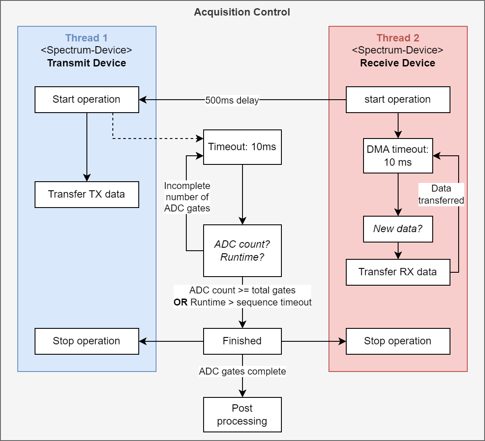
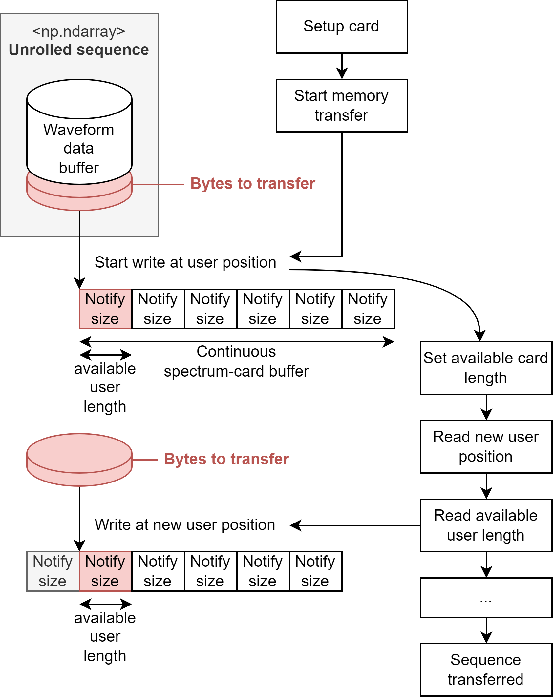
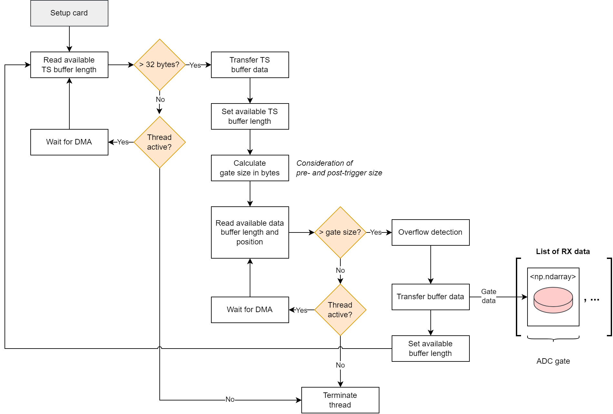

.. _spcm-devices:

Spectrum Devices
================

The acquisition process involves a minimum of two measurement cards, responsible for transmitting and receiving data. 
The coordination between these two devices is supervised by the :ref:`acquisition control <acquisition-control>` and is elaborated upon in the subsequent section.

Device Interaction
------------------

The acquisition control supervises both the transmit and receive devices, each of which operates in its own thread 
Each device is required to implement start and stop operations, responsible for initiating and terminating their respective threads.

To guarantee the seamless operation of the receive card during the execution of the sequence, the threads are initiated with a delay. 
This precautionary measure ensures proper coordination during execution time.

   Interaction of transmit and receive device within the acquisition control.

Upon initiation, the transmit device executes the sequence obtained by streaming the unrolled sequence data to the transmit card. 
While the sequence is executed, the receive card remains in a state of readiness, awaiting the completion of a full gate to transfer the acquired data.

Following the commencement of the transmit operation thread, the acquisition control keeps track of the number of ADC gates and monitors the total runtime, as depicted in :numref:`device-interaction`. 
The acquisition process concludes either when all ADC gates have been recorded or when the runtime surpasses the sequence timeout. 
At this point, both threads are terminated, and the acquired data is then handled in the subsequent postprocessing step.

Transmit Device (TX)
--------------------

The transmit device is response for executing the sequence, i.e. transferring the sequence data to the card memory and replaying it.
The :ref:`sequece provider <seq-provider>` calculates the sequence sample points and ensures their correct order.

   Continuous memory transfer within the operation loop of the transmit device.

In :numref:`tx-device` the streaming process of sequence data is illustrated.
The on-board memory of the transmit card imposes limitations, as the sequence data may surpass the available card memory. 
To address this constraint, the sequence is transferred in segments.

Initially, the entire card buffer is filled. 
As the sequence is replayed, new memory becomes available, measured in units of a notify size. 
The available user length is continuously monitored throughout the sequence execution. 
When there is sufficient space for a new section of the sequence, the sequence data is transferred to the corresponding memory position (user position).

After the new sequence data is transferred, the available user length must be updated to inform the card about the new data.
The card updates the user position, ensuring that the next write operation occurs at the end of the last transferred data. 
This process is reiterated until the entire sequence has been successfully transferred and replayed.

Receive Device
--------------

The receive card is responsible to acquire data within a digital gate signal, which is generated by the transmit card according to the sequence.
The transmission of the gate signal is facilitated through a wired connection that is established between the transmit and receive cards.

   Gate detection and transfer of acquired gate data.

In the gated timestamp mode, the receive card continuously samples data, selectively storing the samples acquired within the gate along with additional samples based on pre and post-trigger sizes.

During operation, the upper loop of the receive card is dedicated to monitoring the timestamp buffer as illustrated in :numref:`rx-device`. 
Each timestamp is represented by a 16-bit value, with a complete gate corresponding to 32 bits. 
While the receive card thread is active and the timestamp buffer holds fewer than two timestamps, the card remains in a waiting state until new memory is written.

Upon detecting a full gate, the gate size is computed from the timestamps, and the timestamp memory becomes available again. 
Using the calculated gate size, the receive card supervises the sample memory, transferring the sample data when all required data is accessible.

Since the card memory is continuously written, there is a potential risk of memory overflow, which is detected and processed accordingly.
The transferred sample point data of a gate is stored in a Numpy array, which is then appended to a list. 
After setting the available sample buffer size, the operation returns to the upper loop, where it resumes monitoring the timestamp buffer.
