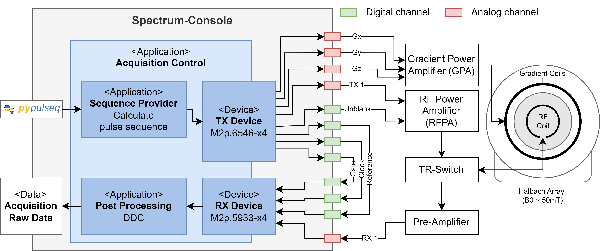

.. _system-setup:

System Setup
============

MRI System
----------

The console setup features a Halbach-configured permanent magnet, providing a static magnetic field of approximately 50 mT. 
Gradient coils for spatial encoding are driven by a gradient power amplifier (GPA) which amplifies the replayed gradient waveforms.
A solenoid volume RF coil is controlled by a passive TR-switch, which toggles between transmit and receive modes.
The transmit path contains an RF power amplifier (RFPA) and the receive path a pre-amplifier with a low noise figure.

For more information about the MRI system see: 

Measurement Cards
-----------------

Developed for a low-field MRI system, this console relies on two Spectrum-Instrumentation measurement 
cards—installed via PCI express slots in the console computer—to facilitate MRI operations.
For our system we use:

- Spectrum Instrumentation AWG card M2p.6546-x4: The Arbitrary Waveform Generator (AWG) or transmit (TX) card replays pulse sequences as analog waveforms.
- Spectrum Instrumentation Digitizer card M2p.5933-x4: The digitizer or receive (RX) card samples analog MRI signals, converting them to digital signals.

The average waveform generator (AWG) or transmit (TX) card replays the RF and gradient waveforms, interpreted from a pulseq sequence.
The digitizer or receive (RX) card samples the MR signal.
To synchronze both cards, the TX card clock is used as the master clock.
The ADC gate is controlled by a digital gate signal which is transferred from TX to RX card. 
For improved phase stability, also a digital reference signal is transmitted and received.
It is used to correct for phase jumps caused by the measurement cards.
A digital un-blanking or RF gate signal is used to enable the RFPA during transmit phase.

Outputs
-------

Transmit card model M2p.6546-x4 provides 4 analog and 4 digital channels. 
We configured the digital channels in synchronous mode, this means that they are played synchronously with the analog channels.
The maximum output of each analog channel can be configured in the `device_config.yaml <https://github.com/schote/spectrum-console/blob/main/device_config.yaml>`_ file.

.. csv-table:: Port description of the transmit (TX) card
   :file: ../_tables/tx_ports.csv
   :widths: 10, 15, 20, 55
   :header-rows: 1

Inputs
------

The RX card model M2p.5933-x4 provides up 8 receive channels which can be enabled via `device_config.yaml <https://github.com/schote/spectrum-console/blob/main/device_config.yaml>`_ file.
Also the maximum amplitude and the impedance can be set (1 equals 50 ohms, 0 equals 1 mega ohms).

.. csv-table:: Port description of the receive (RX) card
   :file: ../_tables/rx_ports.csv
   :widths: 10, 15, 20, 55
   :header-rows: 1