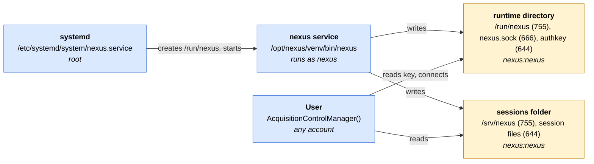

# Deployment: Running the acquisition service as a system daemon

The `nexus` service can run as a systemd unit that is started at boot and shared by every
account on the workstation. All steps below change the system and require root; none of them
is performed by the package itself. Without them, `nexus -d <config>` started by hand keeps
working as described in the user guide (runtime directory `<tempdir>/nexus`).



*Figure: deployment overview. Blue boxes are actors, yellow boxes are locations on disk. The following setup is suggested for deployment:
`755`: the owner (`nexus`) may create and delete entries, everyone else may only list and enter
the directory. `666`: everyone may read and write; for a socket, "write" is what a `connect()`
requires, so any account can reach the service. `644`: everyone may read, only the owner (`nexus`) may write, so clients can fetch the key and the session files but not alter them.*

## 1. Create a Service Account

To run the daemon we use an unprivileged system account which can be created by:

```bash
sudo useradd --system --no-create-home --shell /usr/sbin/nologin --comment "Nexus acquisition service" nexus
```

| Part                                    | Meaning                                                                                     |
| --------------------------------------- | ------------------------------------------------------------------------------------------- |
| `useradd`                               | Linux command for creating a user account.                                                  |
| `--system`                              | Create a **system account**, intended for services/daemons rather than a normal human user. |
| `--no-create-home`                      | Don't create a home directory such as `/home/nexus`.                                        |
| `--shell /usr/sbin/nologin`             | Set the user's login shell to `nologin`, preventing interactive shell logins.               |
| `--comment "Nexus acquisition service"` | Add descriptive information to the account's comment field.                                 |
| `nexus`                                 | The username being created.                                                                 |


## 2. Installation

It is suggested to use the `/opt` directory reserved for add-on application software packages and to install the console application in a virtual environment. 
Create a virtual environment and copy the code.
```bash
sudo python3.13 -m venv /opt/nexus/venv
sudo cp -a code/nexus-console /opt/nexus/
```
Set the service account (`nexus`) as owner and group recursively (`-R`) for virtual environment and repository.
```bash
sudo chown -R nexus:nexus /opt/nexus/nexus-console
sudo chown -R nexus:nexus /opt/nexus/venv
```
Install the nexus-console package using the service account (`nexus`). The installation is done in editable mode (`-e`), to simplify maintenance/updates.
```bash
sudo -u nexus /opt/nexus/venv/bin/pip install --no-cache-dir -e /opt/nexus/nexus-console
```

## 3. Device Configuration

The device configuration is stored in `/etc` which is reserved for configuration files and can be installed as follows.
```bash
sudo install -D -m 644 device_config.yaml /etc/nexus/device_config.yaml
```
The `-D` flag creates any missing parent directories in the destination and permissions are set using `-m 644` (owner: rwx, group: r--, others: r--).

## 4. Setup the session folder

We create a subdirectory in `/srv` which is reserved for data produced by services to store the acquisition data.
```bash
sudo install -d -m 755 -o nexus -g nexus /srv/nexus
```
Creates directory (`-d`) with permissions `-m 755` (owner: rwx, group: r-x, others: r-x) using install. Owner (`-o`) and group (`-g`) is the service account (`nexus`).

## 5. Start the service

To active the service we need to copy the service file, reload the system daemons and enable the service. Make sure to confirm the path configurations in `nexus.service` before enabling it.
```bash
sudo cp src/nexus_service/deployment/nexus.service /etc/systemd/system/nexus.service
sudo systemctl daemon-reload
sudo systemctl enable --now nexus
```
On start systemd creates `/run/nexus` by setting `RuntimeDirectory=` with owner `nexus` and mode `755` (owner: rwx, group: r-x, others: r-x). The service publishes `nexus.sock` and `authkey` in `/run/nexus`, which a client finds automatically. On stop, and after a crash, systemd removes `/run/nexus` again, so no stale socket or key survives. `/run` is owned by root, therefore only root can delete the directory and no other account can place files in it.

## 6. Usage & Inspection

Any account connects without arguments, the examples are unchanged:

```python
with AcquisitionControlManager() as manager:
    ...
```

The service is maintained and inspected with `systemctl` and `journalctl`. Changing the
state of the unit requires root, inspecting it does not:

| Task                                   | Command                                    |
| -------------------------------------- | ------------------------------------------ |
| Start at boot (and now)                | `sudo systemctl enable --now nexus`        |
| Do not start at boot (and stop now)    | `sudo systemctl disable --now nexus`       |
| Start / stop / restart                 | `sudo systemctl start\|stop\|restart nexus` |
| Reload unit file after editing it      | `sudo systemctl daemon-reload`             |
| Status, PID and last log lines         | `systemctl status nexus`                   |
| Is it running / enabled?               | `systemctl is-active nexus`, `systemctl is-enabled nexus` |
| Effective settings of the unit         | `systemctl show nexus -p User,ExecStart,RuntimeDirectory,StateDirectory` |
| Full log                               | `journalctl -u nexus`                      |
| Follow the log live                    | `journalctl -u nexus -f`                   |
| Log since last boot                    | `journalctl -u nexus -b`                   |
| Check socket and key are published     | `ls -l /run/nexus`                         |
