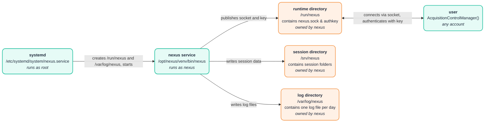

# Deployment: Running the acquisition service as a system daemon

The `nexus` service can run as a systemd unit that is started at boot and shared by every
account on the workstation. All steps below change the system and require root; none of them
is performed by the package itself. Without them, `nexus -d <config>` started by hand keeps
working as described in the user guide (runtime directory `<tempdir>/nexus`).



*Figure: deployment overview. Teal boxes are actors, orange boxes are locations on disk. The
session and log directories are not accessed by `AcquisitionControlManager`; users inspect them
manually. The permission modes used in the steps below mean the following:
`755`: the owner (`nexus`) may create and delete entries, everyone else may only list and enter
the directory. `666`: everyone may read and write; for a socket, "write" is what a `connect()`
requires, so any account can reach the service. `644`: everyone may read, only the owner (`nexus`)
may write, so clients can fetch the key and the session files but not alter them.*

## 1. Create a service account

To run the daemon, we use an unprivileged system account, which can be created with:

```bash
sudo useradd --system --no-create-home --shell /usr/sbin/nologin --comment "Nexus acquisition service" nexus
```

| Part                                    | Meaning                                                                                     |
| --------------------------------------- | ------------------------------------------------------------------------------------------- |
| `useradd`                               | Linux command for creating a user account.                                                  |
| `--system`                              | Create a **system account**, intended for services/daemons rather than a normal human user. |
| `--no-create-home`                      | Don't create a home directory such as `/home/nexus`.                                        |
| `--shell /usr/sbin/nologin`             | Set the user's login shell to `nologin`, preventing interactive shell logins.               |
| `--comment "Nexus acquisition service"` | Add descriptive information to the account's comment field.                                 |
| `nexus`                                 | The username being created.                                                                 |

## 2. Installation

It is suggested to use the `/opt` directory, which is reserved for add-on application software packages, and to install the console application in a virtual environment.
Create a virtual environment, copy the code and install the nexus-console package. Installation is done as root, since files created by root are readable and executable by everyone by default. Editable mode (`-e`) is optional; we use it to simplify maintenance and updates.

```bash
sudo python3.13 -m venv /opt/nexus/venv
sudo cp -r code/nexus-console /opt/nexus/
sudo /opt/nexus/venv/bin/pip install --no-cache-dir -e /opt/nexus/nexus-console
```

## 3. Device configuration

The device configuration is stored in `/etc`, which is reserved for configuration files, and can be installed as follows:

```bash
sudo install -D -m 644 device_config.yaml /etc/nexus/device_config.yaml
```

The `-D` flag creates any missing parent directories in the destination, and permissions are set using `-m 644` (owner: rw-, group: r--, others: r--).

## 4. Set up the session directory

To store the acquisition data, we create a subdirectory in `/srv`, which is reserved for data produced by services:

```bash
sudo install -d -m 755 -o nexus -g nexus /srv/nexus
```

This creates the directory (`-d`) with permissions `755` (owner: rwx, group: r-x, others: r-x). Owner (`-o`) and group (`-g`) are the service account (`nexus`).

## 5. Start the service

To activate the service, we need to copy the unit file, reload systemd and enable the service. Make sure to confirm the paths in `nexus.service` before enabling it.

```bash
sudo cp src/nexus_service/deployment/nexus.service /etc/systemd/system/nexus.service
sudo systemctl daemon-reload
sudo systemctl enable --now nexus
```

On start, systemd creates `/run/nexus` (configured via `RuntimeDirectory=`) with owner `nexus` and mode `755` (owner: rwx, group: r-x, others: r-x). The service publishes `nexus.sock` and `authkey` in `/run/nexus`, where clients find them automatically. On stop, and after a crash, systemd removes `/run/nexus` again, so no stale socket or key survives. `/run` itself is owned by root, so only root can delete `/run/nexus`, and no other account can place files next to it.

Likewise, systemd creates `/var/log/nexus` (configured via `LogsDirectory=`) with owner `nexus` and mode `755`, and the service writes one log file per day (`<date>_nexus.log`) into it, as passed with `--log_dir`. Unlike `/run/nexus`, this directory is kept on stop. Without `--log_dir`, the log file is written to the session folder instead.

## 6. Usage and inspection

Any account connects without arguments; the examples from the user guide are unchanged:

```python
with AcquisitionControlManager() as manager:
    ...
```

The service is maintained and inspected with `systemctl` and `journalctl`. Changing the
state of the unit requires root, inspecting it does not:

| Task                                   | Command                                    |
| -------------------------------------- | ------------------------------------------ |
| Start at boot (and now)                | `sudo systemctl enable --now nexus`        |
| Do not start at boot (and stop now)    | `sudo systemctl disable --now nexus`       |
| Start / stop / restart                 | `sudo systemctl start\|stop\|restart nexus` |
| Reload unit file after editing it      | `sudo systemctl daemon-reload`             |
| Status, PID and last log lines         | `systemctl status nexus`                   |
| Is it running / enabled?               | `systemctl is-active nexus`, `systemctl is-enabled nexus` |
| Effective settings of the unit         | `systemctl show nexus -p User,ExecStart,RuntimeDirectory,StateDirectory` |
| Full log (terminal output)             | `journalctl -u nexus`                      |
| Log files                              | `ls -l /var/log/nexus`                     |
| Follow the log live                    | `journalctl -u nexus -f`                   |
| Log since last boot                    | `journalctl -u nexus -b`                   |
| Check socket and key are published     | `ls -l /run/nexus`                         |
